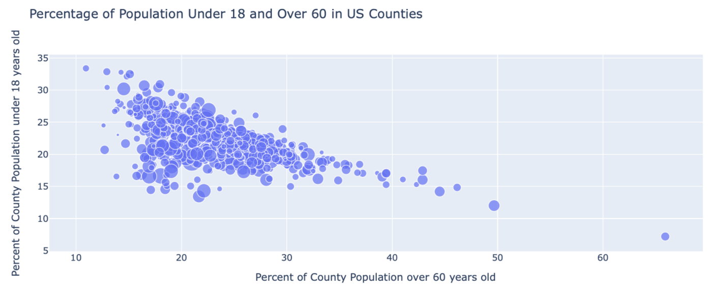
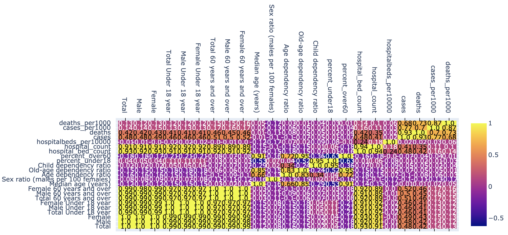

# 0421-Covid19_Sanny-YE

# Crisis Management with Covid-19 Data
## Background 
In this project, we will analyze data from the US Census, American Community Survey, New York Times, and US Hospital data to gain more insights into how different counties might need to implement social distancing and work from home policies or to better manage supply needs based on the county population demographics and available hospital beds in the counties.

### Business Question
1) Which counties are most vulnerable based on population demographics and hospital bed availability?
2) How should different counties adjust their policies to limit the spread of the virus and ensure that enough resources are prepared for the patients?

### Data Question 
1) Which counties are most populated in the U.S.?
2) Is there a correlation between hospital resources and population make-up?

## Data Analysis
By creating bubble charts of the percentage of the population over 60 years old on the x-axis, the percentage of the population under 18 on the y-axis, and the size of the scatter point corresponding to the number of hospital beds available in that county per 1000 people, we can get an idea of what counties might be most vulnerable to becoming overwhelmed by the COVID-19 pandemic.

We also created a heatmap that shows the correlation between different factors in our dataset. Based on the heatmap, we can summarize our findings:
1) Hospital count and hospital bed count are closely related to the population of male and female over 60 years old and under 18 years old. 
2) Generally, most counties have around 20%-25% of its population under 18 and around 17%-25% of its population over 60 and those counties have the highest per-capita count for hospitals and hospital beds. 
3) The number of cases is hardly related to the population make-up of counties. As a result, the per capita statistic for cases is also hardly related to the population make-up of counties.
4) The number of deaths is also hardly related to the population make-up of counties and the same for deaths per 1000.

## Conclusion

## Additional Links
1) Data Source: https://github.com/jhu-business-analytics/covid-19-case-python-data-analysis
2) Tutorial: https://melanieshimano.gitbook.io/merging-data-and-plotly-visualizations/
